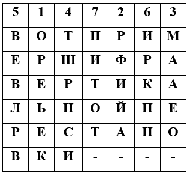
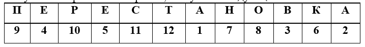
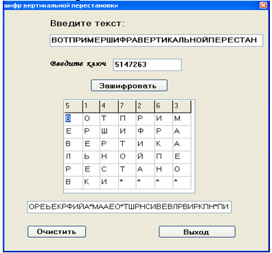

# Набор лабораторных работ по защите информации

## lab1
Шифр вертикальной перестановки\
В нем используется прямоугольник, в который сообщение вписывается по строкам слева направо.
Выписываются буквы по вертикали, столбцы при этом берутся в порядке, определяемом ключом.
Пусть, например, этот ключ таков: (5,1,4,7,2,6,3), и с его помощью надо зашифровать сообщение:
ВОТПРИМЕРШИФРАВЕРТИКАЛЬНОЙПЕРЕСТАНОВКИ.\
Впишем сообщение в прямоугольник, столбцы которого пронумерованы в соответствии с ключом.\
Выбирая столбцы в порядке, заданном ключом, и выписывая последовательно буквы каждого из них сверху вниз,
получаем: ОРЕЬЕКРФИЙА-МААЕО-ТШРНСИВЕВЛРВИРКПН-ПИТОТ-.\

Ключ ШВП можно извлекать из какого-то легко запоминающегося слова или предложения.
Например, можно приписывать буквам числа в соответствии с обычным алфавитным порядком букв.
Допустим, ключевым словом будет ПЕРЕСТАНОВКА. Присутствующая в нем буква А получает номер 1.
Если какая-то буква входит несколько раз, то ее появления нумеруются последовательно слева направо.
Поэтому второе вхождение буквы "А" получает номер 2. 
Поскольку буквы Б в этом слове нет, то буква "В" получает номер 3 и так далее.
Процесс продолжается до тех пор, пока все буквы не получат номера. Таким образом, получаем следующий ключ.\

Для обеспечения дополнительной скрытности можно повторно зашифровать сообщение, которое уже прошло шифрование.
Такой метод шифрования называется двойной перестановкой. В этом случае перестановки определяются отдельно для столбцов и отдельно для строк.
Сначала в таблицу записывается текст сообщения, потом поочередно переставляются столбцы, а затем строки.
При расшифровании порядок перестановок должен быть обратным.
Однако двойная перестановка не отличается высокой стойкостью и сравнительно просто взламывается при любом размере таблицы шифрования.\

## lab2
